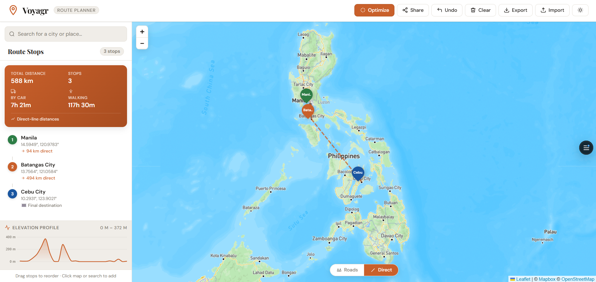
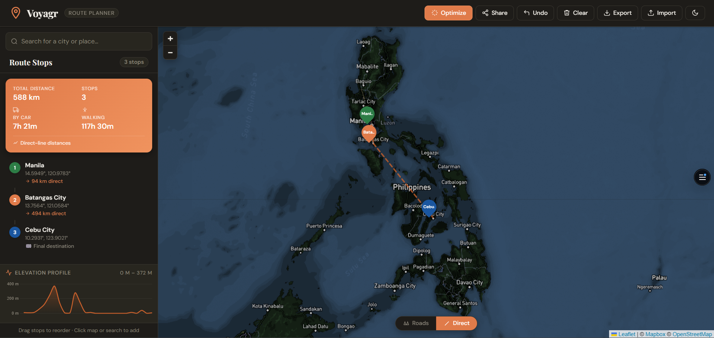
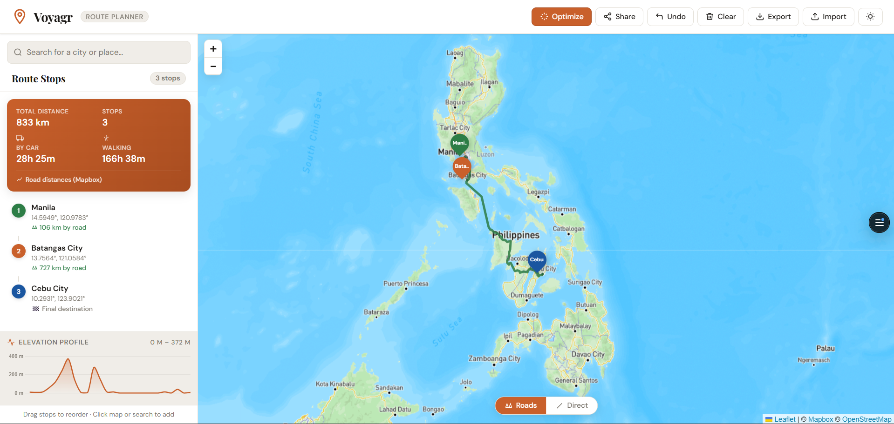
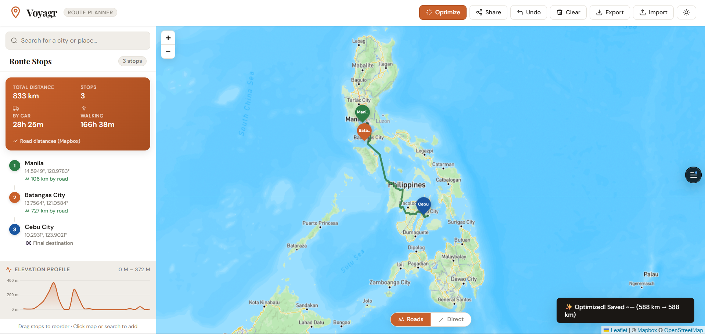

# 🗺️ Voyagr — Travel Route Planner

> A beautiful, interactive travel route planner built with Leaflet.js + Mapbox. Plan trips, get real road directions, visualize elevation profiles, and share routes via URL.









---

## ✨ Features

### Core
| Feature | Description |
|---|---|
| **Interactive Map** | Leaflet.js powered map with Mapbox Streets tiles |
| **Click-to-Add Stops** | Click anywhere on the map to add a waypoint |
| **Named Stops** | Label every stop (e.g. *"Eiffel Tower"*, *"Hotel Lutetia"*) |
| **Route Visualization** | Animated dashed polylines connecting all stops in order |
| **Distance Tracking** | Per-segment and total distance using the Haversine formula |
| **Trip Summary Card** | Total distance, stop count, estimated car & walking times |
| **Drag-to-Reorder** | Drag stops in the sidebar to change route order |
| **Undo / Clear** | Remove the last stop or reset the entire route |
| **Export JSON** | Download your route as a timestamped `.json` file |
| **Import JSON** | Reload any previously exported route |
| **Dark / Light Mode** | Smooth theme toggle with CSS variable system |
| **Responsive Layout** | Works on desktop, tablet, and mobile |

### Advanced (v2)
| Feature | Description |
|---|---|
| **① Geocoding Search** | Type any city or landmark — searches via Mapbox Geocoding or Nominatim (OSM fallback) |
| **② Elevation Profile** | Live terrain chart for your full route via Open-Elevation API (free, no key) |
| **③ Named Stops** | Modal prompt on every new stop; rename any stop in-sidebar at any time |
| **④ Route Optimization** | TSP nearest-neighbor algorithm minimizes total trip distance in one click |
| **⑤ URL Sharing** | Full route (coords + names) encoded as base64 in the URL hash — share with anyone |
| **⑥ Road Routing** | Real road geometry + driving distances via Mapbox Directions API |

---

## 📁 File Structure

```
voyagr-travel-route-planner/
├── index.html          # Single-page app shell + HTML structure
├── style.css           # All styles, CSS variables, dark mode, animations
├── script.js           # All JS logic — map, routing, geocoding, elevation, TSP
├── favicon.ico         # Browser tab icon (16×16, 32×32, 48×48)
├── apple-touch-icon.png # iOS home screen icon (180×180)
├── og-image.png        # Social preview image (1200×630)
├── vercel.json         # Vercel deployment configuration
├──.gitignore           # Ignore node_modules, dist/, .env, etc.
├──.env                 # Local environment variables
├──build.js             # Build script to inject Mapbox token at deploy time
└── README.md           # This file
```

## 🗝️ Mapbox Token Setup

Voyagr works without any token (OpenStreetMap fallback). A Mapbox token unlocks:

- 🛣️ Real road routing (Mapbox Directions API)
- 🔍 Enhanced geocoding (Mapbox Geocoding API)
- 🗺️ Mapbox Streets tiles (higher quality rendering)

### ⚠️ Security model — how the token stays out of GitHub

`script.js` in the repo contains only a **safe placeholder**:

```js
const MAPBOX_TOKEN = '%%MAPBOX_TOKEN%%'; // replaced by build.js at deploy time
```

`build.js` reads the real token from the environment and writes a compiled copy into `dist/script.js` before the site is served. **Your token never exists in any committed file.**

### Local Development

```bash
# 1. Copy the env template
cp .env.example .env

# 2. Edit .env — paste your token on the MAPBOX_TOKEN line
#    MAPBOX_TOKEN=pk.eyJ1IjoicmFscGhyb3...your_real_token

# 3. Inject the token into script.js in-place
node build.js

# 4. Open index.html with VS Code Live Server (or any static server)
#    Mapbox tiles, road routing & geocoding are now active ✅
```

**Before committing to git**, always restore the safe placeholder:

```bash
node build.js --restore
# script.js is back to %%MAPBOX_TOKEN%% — safe to push
```

> `build.js --restore` is important. If you forget and run `git status` you'll see `script.js` as modified (it has your real token in it). Always restore before `git add`.

Get a free token at [account.mapbox.com](https://account.mapbox.com/).

---

## 🧮 How Distance Calculation Works

### Haversine Formula

Voyagr uses the **Haversine formula** to calculate the great-circle distance between two GPS coordinates — the shortest path on the surface of a sphere.

```
a = sin²(Δlat/2) + cos(lat₁) · cos(lat₂) · sin²(Δlng/2)
c = 2 · atan2(√a, √(1−a))
d = R · c
```

Where `R = 6,371 km` (Earth's mean radius).

This gives accurate results for any distance on Earth, accounting for its curvature. It's what aviation and mapping apps use. Accuracy is within ~0.5% for typical travel distances.

### Road Routing Distances

When **Road** mode is active (requires Mapbox token), distances are fetched from the **Mapbox Directions API** and reflect actual road network distances — typically 20–40% longer than straight-line Haversine distances.

### TSP Route Optimization

The **Optimize** button runs a **nearest-neighbor greedy heuristic**:

1. Start from the first stop (kept as anchor)
2. At each step, jump to the closest unvisited stop
3. Repeat until all stops are visited

Time complexity: **O(n²)** — instant for up to ~100 stops. The algorithm gives results within 20–25% of the true optimum in most real-world cases.

---

## 🎮 How to Use

### Adding Stops
- **Click on the map** anywhere to add a stop — a label modal will appear
- **Search** for a city or landmark in the search bar (top of sidebar)
- After naming the stop, it appears on the map and in the sidebar

### Managing Your Route
- **Drag** stops in the sidebar list to reorder them
- **Click a stop name** in the sidebar to rename it
- **Click a stop** item to pan the map to that location
- **✕ button** on any stop removes it
- **Undo** removes the most recently added stop
- **Clear** resets the entire route (with confirmation)

### Road Routing
- Toggle **Roads / Direct** at the bottom of the map
- **Roads** (green lines) fetches real road geometry from Mapbox
- **Direct** (orange dashed lines) uses straight-line Haversine distances
- Road mode requires a Mapbox token

### Elevation Profile
- Automatically appears below the stop list whenever 2+ stops are added
- Shows terrain elevation sampled along the full route
- Displays min/max elevation range in metres

### Optimize Route
- Click **Optimize** (orange button, top bar) when you have 3+ stops
- Runs the TSP nearest-neighbor algorithm
- Reports how many km were saved

### Sharing
- Click **Share** to encode the full route into the URL hash and copy it
- Anyone opening that URL will have the route automatically loaded
- Route data is stored in the URL — no server or database needed

### Export / Import
- **Export** downloads a `.json` file with all stop coordinates and names
- **Import** reloads any exported file and fits the map to the stops

---

## 🔧 Configuration Reference

All configuration lives at the top of `script.js`:

```js
const MAPBOX_TOKEN   = '...';     // Your Mapbox token
const HAS_MAPBOX     = true/false;// Auto-detected from token
const DEFAULT_CENTER = [48.8566, 2.3522]; // Map start position (Paris)
const DEFAULT_ZOOM   = 5;         // Initial zoom level
const CAR_KMH        = 80;        // Assumed average driving speed
const WALK_KMH       = 5;         // Assumed average walking speed
```

To change the default map view, edit `DEFAULT_CENTER` to `[lat, lng]` of your preferred city and adjust `DEFAULT_ZOOM`.

---

## 🌐 APIs Used

| API | Purpose | Key Required | Cost |
|-----|---------|-------------|------|
| [Mapbox Maps](https://docs.mapbox.com/api/maps/) | Map tiles (Streets style) | ✅ Yes (`pk.`) | Free tier: 50k loads/mo |
| [Mapbox Geocoding](https://docs.mapbox.com/api/search/geocoding/) | Place search | ✅ Yes (`pk.`) | Free tier: 100k req/mo |
| [Mapbox Directions](https://docs.mapbox.com/api/navigation/directions/) | Road routing | ✅ Yes (`pk.`) | Free tier: 100k req/mo |
| [Nominatim (OSM)](https://nominatim.org/) | Place search fallback | ❌ No | Free (usage policy applies) |
| [Open-Elevation](https://open-elevation.com/) | Elevation profile | ❌ No | Free & open source |
| [Leaflet.js](https://leafletjs.com/) | Map rendering library | ❌ No | MIT open source |
| [Chart.js](https://www.chartjs.org/) | Elevation chart | ❌ No | MIT open source |

---

## 🏗️ Architecture Notes

The app is intentionally **framework-free** — vanilla HTML, CSS, and JavaScript only.

- **State** is a plain `stops[]` array; every change calls `refreshRoute()` which redraws everything
- **Routing** is async — road mode awaits the Directions API before updating the sidebar
- **Sharing** encodes state as `btoa(JSON.stringify(stops))` into the URL hash — no backend needed
- **Elevation** is fetched opportunistically; failures are silent (non-critical feature)
- **Dark mode** is purely CSS custom properties toggled with a class on `<body>`

---

<div align="center">
  Made with ❤️ and ☕ by Ralph Rosael · Built with Leaflet + Mapbox + Chart.js
</div>
